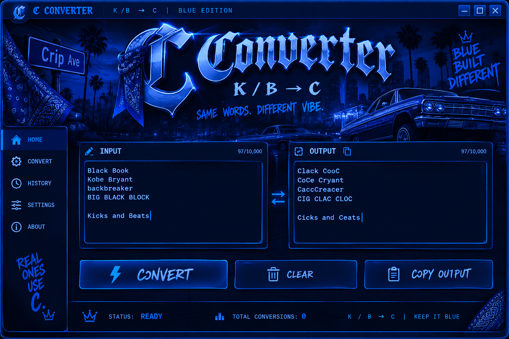

<!-- ═══════════════════════════════════════════════════════════════════════ -->
<!--                    D-CRIP-TED · BLUE EDITION · README                     -->
<!-- ═══════════════════════════════════════════════════════════════════════ -->

<div align="center">

<!-- ══════════════ ANIMATED HEADER ══════════════ -->


<!-- ══════════════ TITLE BLOCK ══════════════ -->

<h1>🅳-🅲🆁🅸🅿-🆃🅴🅳</h1>

<h3><code>K / B → C</code></h3>

<p><i>« SAME WORDS. DIFFERENT VIBE. »</i></p>

<!-- ══════════════ BADGES ══════════════ -->

<p>
  
  
  
  
  
</p>

<p>
  
  
  
</p>

<!-- ══════════════ DIVIDER ══════════════ -->


</div>

<!-- ═══════════════════════════════════════════════════════════════════════ -->
<!--                            📸 SCREENSHOT                                  -->
<!-- ═══════════════════════════════════════════════════════════════════════ -->

<div align="center">

## 📸 &nbsp; P R E V I E W

<!-- 
  ⚠️ IMPORTANT — replace the src below with your own uploaded image path:
  1. Download the image from your ChatGPT share link.
  2. Upload it to your repo (e.g. → assets/dcrypted-preview.png).
  3. Update the src attribute accordingly.
-->



<br/>
<br/>

> 🖼️ *The Blue Edition interface — sleek, dark, and electrifying.*
> <br/>
> <sub>If the image doesn't load, upload your screenshot to <code>/assets/dcrypted-preview.png</code>.</sub>

</div>

<!-- ══════════════ DIVIDER ══════════════ -->

<div align="center">

</div>

<!-- ═══════════════════════════════════════════════════════════════════════ -->
<!--                            ✨ FEATURES                                     -->
<!-- ═══════════════════════════════════════════════════════════════════════ -->

<div align="center">

## ✨ &nbsp; F E A T U R E S

</div>

<table align="center" width="95%">
  <tr>
    <td width="50%" valign="top">

### ⚡ &nbsp; Instant Conversion
> Replace every **K** and **B** with **C** — in a single click.

### 🕘 &nbsp; Conversion History
> Every conversion is logged. Review, reuse, or clear it anytime.

### ⚙️ &nbsp; Customizable Settings
> Auto-convert on type, preserve case, toggle notifications, and more.

    </td>
    <td width="50%" valign="top">

### 🎨 &nbsp; Blue Edition Theme
> A deep, glowing, cyber‑blue aesthetic — easy on the eyes.

### 📋 &nbsp; One‑Click Copy
> Copy your converted output instantly to the clipboard.

### 📱 &nbsp; Fully Responsive
> Works seamlessly on desktop, tablet, and mobile.

    </td>
  </tr>
</table>

<!-- ══════════════ DIVIDER ══════════════ -->

<div align="center">

</div>

<!-- ═══════════════════════════════════════════════════════════════════════ -->
<!--                            🚀 QUICK START                                 -->
<!-- ═══════════════════════════════════════════════════════════════════════ -->

<div align="center">

## 🚀 &nbsp; Q U I C K &nbsp; S T A R T

</div>

```bash
# 1 ─ Clone the repository
git clone https://github.com/yourusername/d-crip-ted.git

# 2 ─ Enter the directory
cd d-crip-ted

# 3 ─ Open in your browser
open index.html         # macOS
start index.html        # Windows
xdg-open index.html     # Linux
```

<div align="center">

**No build tools. No dependencies. No setup.** ✨
<br/>
Just open the file and go.

</div>

<!-- ══════════════ DIVIDER ══════════════ -->

<div align="center">

</div>

<!-- ═══════════════════════════════════════════════════════════════════════ -->
<!--                            🧭 USAGE                                       -->
<!-- ═══════════════════════════════════════════════════════════════════════ -->

<div align="center">

## 🧭 &nbsp; H O W &nbsp; I T &nbsp; W O R K S

</div>

<div align="center">

|  Step  |  Action  |  Description  |
|:------:|:--------|:--------------|
|  **①**  | ✎ **Paste** | Type or paste your text into the **INPUT** panel. |
|  **②**  | ⚡ **Convert** | Hit **CONVERT TO C** to transform K / B → C. |
|  **③**  | ▣ **Copy** | Grab the result with **COPY OUTPUT**. |
|  **④**  | 🕘 **Review** | Revisit past conversions in **HISTORY**. |
|  **⑤**  | ⚙️ **Tune** | Adjust behavior in **SETTINGS**. |

</div>

<details>
<summary align="center"><b>🔍 &nbsp; Click to see a conversion example</b></summary>

<br/>

<div align="center">

<table width="80%">
<tr>
  <th>🔵 Input</th>
  <th>🟦 Output</th>
</tr>
<tr>
  <td><code>The quick brown fox jumps over the lazy dog.</code></td>
  <td><code>The quiCc Cron fox jumps over the lazy dog.</code></td>
</tr>
<tr>
  <td><code>Bake a big black cake, Bobby.</code></td>
  <td><code>CaCe a Cig ClacC caCe, CoCCy.</code></td>
</tr>
</table>

</div>

</details>

<!-- ══════════════ DIVIDER ══════════════ -->

<div align="center">

</div>

<!-- ═══════════════════════════════════════════════════════════════════════ -->
<!--                            🛠 TECH STACK                                  -->
<!-- ═══════════════════════════════════════════════════════════════════════ -->

<div align="center">

## 🛠 &nbsp; T E C H &nbsp; S T A C K

<br/>


</div>

<!-- ══════════════ DIVIDER ══════════════ -->

<div align="center">

</div>

<!-- ═══════════════════════════════════════════════════════════════════════ -->
<!--                            📂 STRUCTURE                                   -->
<!-- ═══════════════════════════════════════════════════════════════════════ -->

<div align="center">

## 📂 &nbsp; P R O J E C T &nbsp; S T R U C T U R E

</div>

```plaintext
📦 d-crip-ted/
├── 📄 index.html              # Main application (all-in-one)
├── 📁 assets/
│   ├── 🖼️ blue_converter_theme.png
│   └── 🖼️ dcrypted-preview.png     ← your screenshot goes here
├── 📄 README.md
└── 📄 LICENSE
```

<!-- ══════════════ DIVIDER ══════════════ -->

<div align="center">

</div>

<!-- ═══════════════════════════════════════════════════════════════════════ -->
<!--                            🎨 COLOR PALETTE                               -->
<!-- ═══════════════════════════════════════════════════════════════════════ -->

<div align="center">

## 🎨 &nbsp; B L U E &nbsp; P A L E T T E

</div>

<div align="center">

| Swatch | Hex | Role |
|:------:|:----|:-----|
|  | `#020916` | Background |
|  | `#020b1c` | Panels |
|  | `#075cc4` | Borders |
|  | `#087dff` | Primary Accent |
|  | `#168cff` | Highlight |
|  | `#71b5ff` | Text |
|  | `#dcecff` | Foreground |

</div>

<!-- ══════════════ DIVIDER ══════════════ -->

<div align="center">

</div>

<!-- ═══════════════════════════════════════════════════════════════════════ -->
<!--                            🗺 ROADMAP                                     -->
<!-- ═══════════════════════════════════════════════════════════════════════ -->

<div align="center">

## 🗺 &nbsp; R O A D M A P

</div>

- [x] ⚡ Core K / B → C conversion engine
- [x] 🕘 Conversion history panel
- [x] ⚙️ Customizable settings menu
- [x] 🎨 Blue Edition theme
- [ ] 🌗 Dark / Light mode toggle
- [ ] 🔤 Additional cipher modes
- [ ] 💾 Export history as JSON
- [ ] 🌐 Multi-language UI support

<!-- ══════════════ DIVIDER ══════════════ -->

<div align="center">

</div>

<!-- ═══════════════════════════════════════════════════════════════════════ -->
<!--                            🤝 CONTRIBUTING                                -->
<!-- ═══════════════════════════════════════════════════════════════════════ -->

<div align="center">

## 🤝 &nbsp; C O N T R I B U T I N G

Contributions, issues, and feature requests are welcome!
<br/>
Feel free to check the <a href="../../issues">issues page</a>.

<br/><br/>

<a href="../../issues/new">
  
</a>
<a href="../../issues/new">
  
</a>

</div>

<!-- ══════════════ DIVIDER ══════════════ -->

<div align="center">

</div>

<!-- ═══════════════════════════════════════════════════════════════════════ -->
<!--                            📜 LICENSE                                     -->
<!-- ═══════════════════════════════════════════════════════════════════════ -->

<div align="center">

## 📜 &nbsp; L I C E N S E

Released under the **MIT License**.
<br/>
See <a href="./LICENSE">LICENSE</a> for details.

</div>

<!-- ══════════════ DIVIDER ══════════════ -->

<div align="center">

</div>

<!-- ═══════════════════════════════════════════════════════════════════════ -->
<!--                            💙 FOOTER                                      -->
<!-- ═══════════════════════════════════════════════════════════════════════ -->

<div align="center">

<br/>

<h2>D-Crip-Ted</h2>

<p><b>K / B → C</b></p>

<p><i>« Keep it blue. »</i></p>

<br/>

<a href="../../stargazers">
  
</a>

<br/><br/>


</div>

<!-- ═══════════════════════════════════════════════════════════════════════ -->
<!--  END OF README · D-Crip-Ted · Blue Edition · © 2025                        -->
<!-- ═══════════════════════════════════════════════════════════════════════ -->
